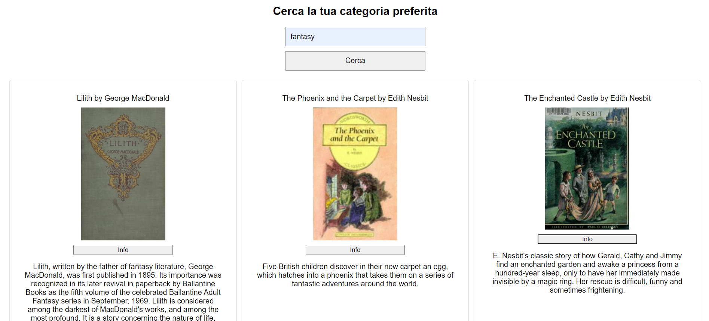

# WebApp per Incentiva la Lettura 
 

Quest'applicazione web è stata progettata per aiutare gli utenti a trovare e scoprire nuovi libri da leggere. Utilizza il servizio esterno Open Library per cercare libri in base alla categoria e mostrare informazioni dettagliate sui libri selezionati. 

# Funzionalità
- **Ricerca Libri per Categoria:** Gli utenti possono cercare libri filtrandoli per categoria utilizzando una casella di testo. 
- **Visualizzazione dei Risultati:** Per ogni libro trovato, verranno mostrati la copertina, il titolo e l'autore. 
- **Descrizione del Libro:** Gli utenti possono ottenere una descrizione dettagliata di ogni libro cliccando sul pulsante "info" associato al libro. 

# Tecnologie Utilizzate 
- **Frontend:** HTML, CSS e JavaScript
- **API di Open Library** per la ricerca e la visualizzazione dei dati sui libri. 

# Installazione 
1. **Clonare il repository** 
`git clone https://github.com/giacomomontepino/Library.git` 
2. **Aprire il file index.html** 

# Utilizzo
1. **Ricerca dei libri**
    - Inserire una categoria di interesse nella casella di testo. 
    - Premere il pulsante "Cerca" per avviare la ricerca. 
    - I risultati della ricerca mostreranno la copertina, il titolo e l'autore di ogni libro. 
2. **Ottenere la Descrizione di un Libro**
    - Per ogni libro nei risultati della ricerca, cliccare sul pulsante "info".
    - Verrà effettuata una chiamata API ad Open Library per ottenere la descrizione del libro selezionato e visualizzarla. 

# Link Utili
- **Applicazione web:** https://librarygiacomomontepino.netlify.app/
